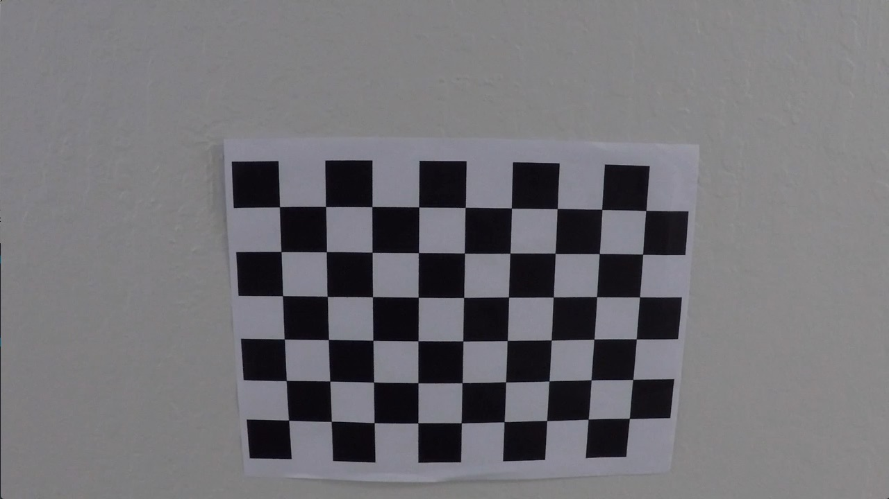
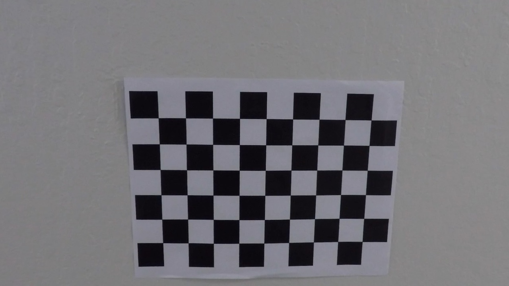
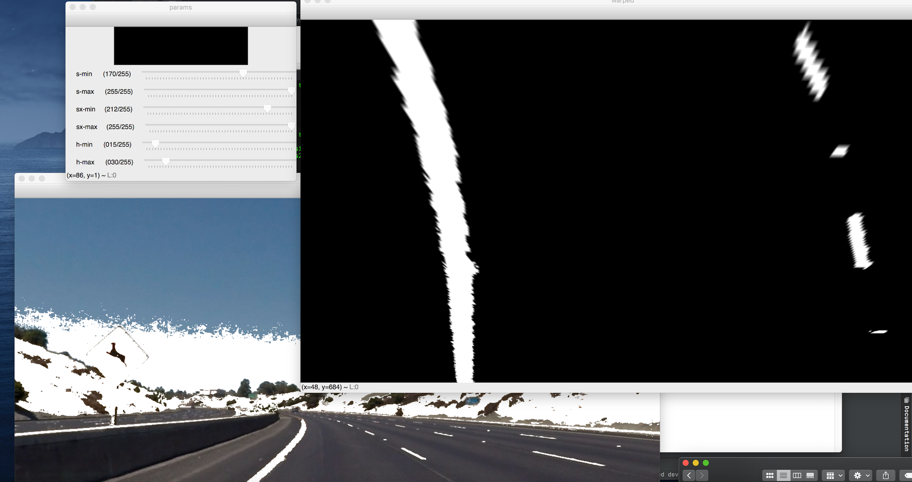
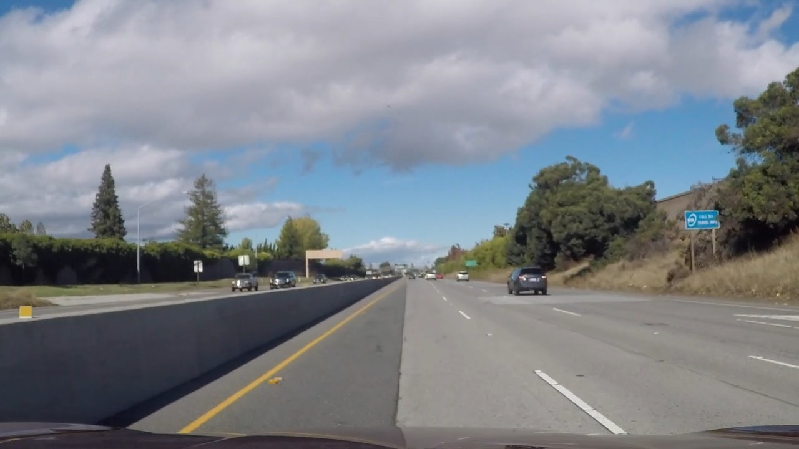
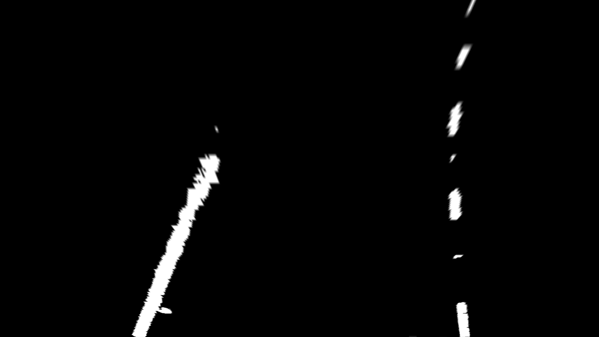
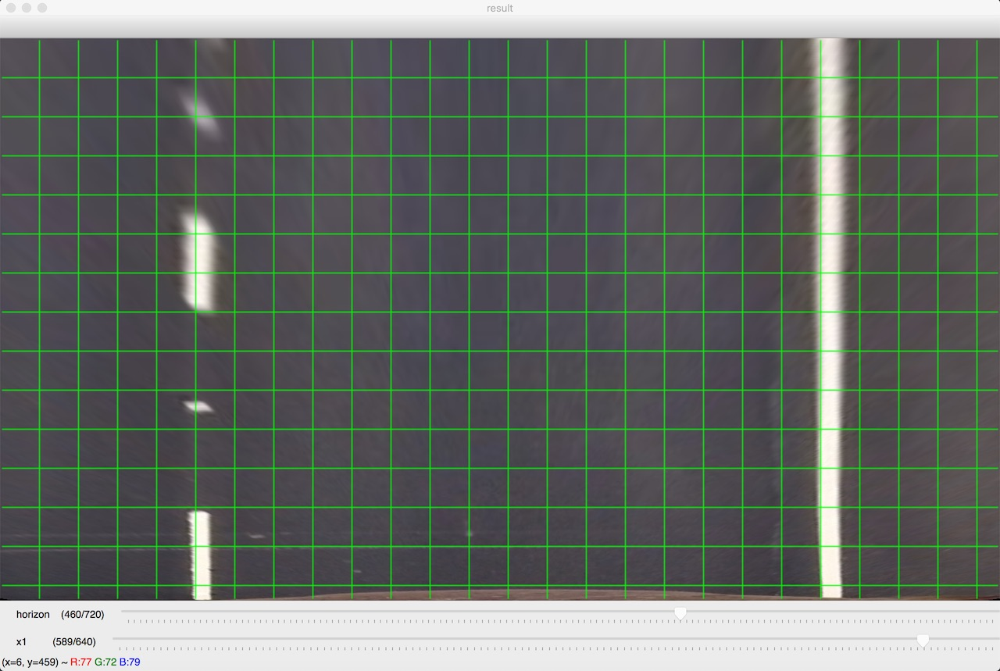
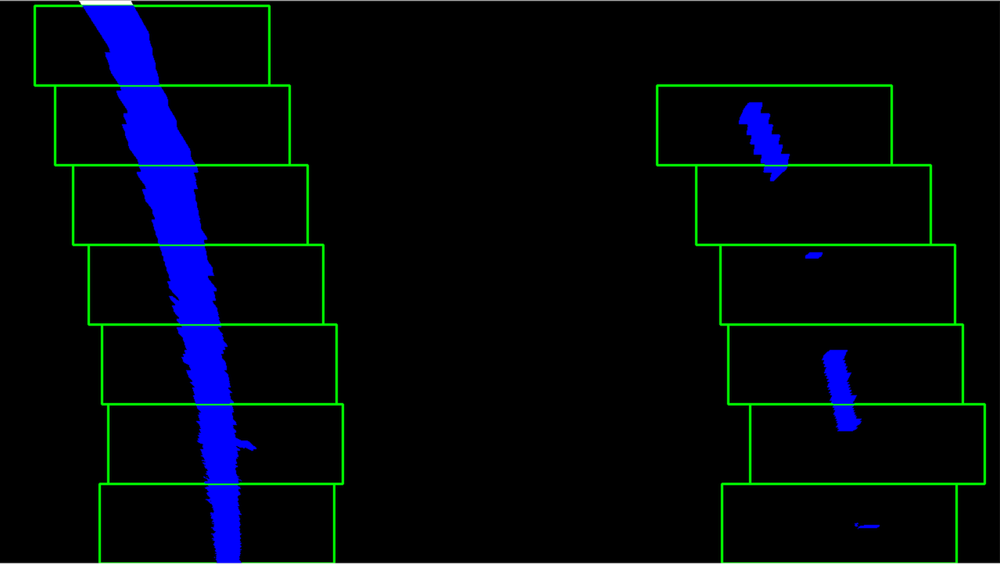
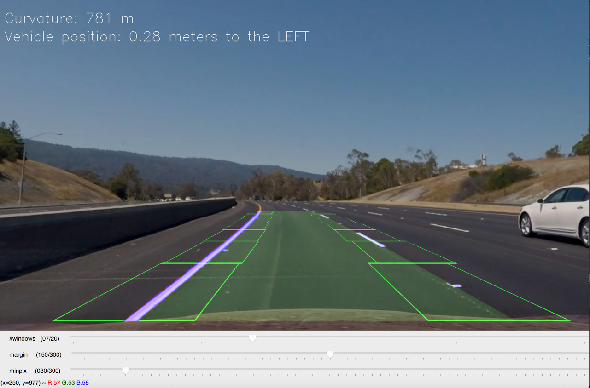
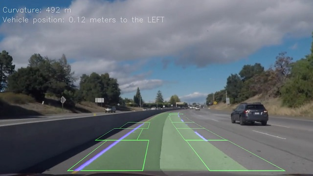

## Advanced Lane Finding
### Project Report


The goals / steps of this project are the following:

* Compute the camera calibration matrix and distortion coefficients given a set of chessboard images.
* Apply a distortion correction to raw images.
* Use color transforms, gradients, etc., to create a thresholded binary image.
* Apply a perspective transform to rectify binary image ("birds-eye view").
* Detect lane pixels and fit to find the lane boundary.
* Determine the curvature of the lane and vehicle position with respect to center.
* Warp the detected lane boundaries back onto the original image.
* Output visual display of the lane boundaries and numerical estimation of lane curvature and vehicle position.

### Camera Calibration
The code for this step is contained in src/camera.py (`calibrate_images` method). The runner that coordinates whole process is present in calibrate.py file.

Calibration begins with preparing "objects points" - (x, y, z) coordinates if chessboard corners in real world space. Since the pattern is flat, z is always zero and x, y are distributed evenly to form a grid.
For this project 9x6 grid is used.

Image is converted to grayscale and corners are search by using findCheesboardCorners function from opencv:
```python
gray = cv2.cvtColor(image, cv2.COLOR_BGR2GRAY)
        size = gray.shape[::-1]
        ret, corners = cv2.findChessboardCorners(gray, (nx, ny), None)
        if ret:
            objpoints.append(objp)
            imgpoints.append(corners)
``` 

If corners are actually found, they are added to calibration data (as imagepoints) together with objectpoints.
The process is repeated for each calibration image. After processing last image, calibration data is obtained by using cv2.calibrateCamera function.

The coefficients can now be used to undistort images:



### Pipeline (single images)
The pipeline uses a set of parameters defined in `src/parameters.py`. The main pipeline file is present in `src/pipeline.py` file, while `find_lanes.py` is a runner that accepts a input and output (video) filename and runs the process.
A few helper tools were created to support calculating parameters for pipeline. They will be described in section below.

#### 1. Distortion correction
The pipeline process starts by correcting the image distortion by using `mtx` and `dist` coefficients taken from camera calibration.
Image is then undistorted using `camera.undistort`.

Example:

Original image:

 
Processed image:


#### 2. Thresholding 
The second step of the pipeline thresholds the image to obtain clear black and white picture containing lanes. 
I was experimenting with different coefficients for thresholding, mainly:
* Using L channel from HSL
* Using S channel from HSL
* Using yellow mask based on HSV image
* Using Sobel transforms

I created a tool, present in `threshold_gui.py` file that allows to visualize effect of different parameters.  


In the end the following combination is used  (`src/lane_finder.py`, `threshold` method):
* Yellow mask  (15, 60, 255) - (30, 255, 255) in HSV
* L mask (170 - 255)
* Sobel mask taken over x and y  (212 - 255)

I was quite suprised, that most of the job is done just by color masking and Sobel effect is rather minimal.
Finally I have decided to include Sobel calculated on both x and y axis, since *lanes we are looking for are diagonal* because of image perspective.
Using just x-axis cracks on road surface as lines.

The parameters above allow to identify lanes also on non-ideal frames, like ones from challenge_video.



#### 3. Perspective transform
After thresholding, a perspective transform in applied.
The base of transform was set to:
```python
    srcpoints = np.array([[x1, horizon],
                          [1280 - x1, horizon],
                          [300, 700],
                          [980, 700]
                          ], dtype="float32")

    dstpoints = np.array([[310, 0],
                          [970, 0],
                          [310, 720],
                          [970, 720]
                          ], dtype="float32")
```

 To help obtain parameters, I have created a gui tool present in `warp_gui.py` that visualized effect of perspective transform.
The tool uses a method `toBirdsEye` from `src/lane_finder.py` (used in real pipeline) and allows playing with x1 and horizon parameters.


 
The x1 and horizon were finally set to 590 and 460.

#### 4. Finding lane pixels
After we get the birds-eye view of the image, a method `find_lane_pixels_v2` from `src/lane_finder.py` is run.
The basic process is as follows:


##### Find starting windows
First step is to locate windows lanes at bottom of the image. This is done using histogram method (`find_start_windows_histogram`):
1. Take bottom half of image and calculate histogram
2. Take left half of histogram and find max value - this is center of left lane
3. Take right lane of histogram and find max value - this is center of right lane

The points are then positioned inside windows of given width and height.
 
During the project I have experimented in more advanced window finding, using just a window height as histogram input. Those method is present in `challenge` branch, yet it did not give significant improvement.

##### Find lanes using moving windows
When we have position of starting windows the `window_trace` function is called for each lane.
It calculates *good* (non-zero) pixels in given window and moves window up. Additionally, if number of non-zero pixels exceed the parameter `minpix`, the window is moved horizontally to the mean x-value of good points.
If there are no good pixels, window is marked as empty. If more than 4 empty windows are found, process is ended. 

All good pixels form a dataset that will be used to fit a lane.

##### Polyfit 
After we have points for left and right lanes, each of them is fit with 2nd order polynomial using
```python
def fit_poly(img_shape, x, y, ploty):
    fit = np.polyfit(y, x, 2)
    fitx = fit[0] * ploty ** 2 + fit[1] * ploty + fit[2]
    return fitx, fit

```
As the result we get the coefficient values of fitted curve and it's x values.
Note: lanes are fit in f(y) = x not f(x) = y. This is because they are mostly vertical. 

The whole process can be visualized using a gui tool `pipeline_gui.py` that allows adjusting fitting parameters.




This process works well, as long as the curvature is low enough. On extreme curves, like in `harder_challenge_video` it fails, since window width and minpix effectively limit maximum detected curvature.
I've created experimental version that uses window extension - it extends current window left or right until there are lane pixels at it's end: the recentering works much better since all lane parts are included.
```python

            extend_right = True
            current_left = win_x_high
            current_right = win_x_high + 10
            while extend_right:
                add_inds = ((nonzeroy >= win_y_low) & (nonzeroy < win_y_high) & (nonzerox >= current_left) & (
                nonzerox < current_right)).nonzero()[0]
                if len(add_inds) > minpix:
                    good_inds = np.append(good_inds, add_inds)
                    current_left = current_right
                    current_right = current_left + 10
                else:
                    win_x_high = current_right
                    extend_right = False
```
The code in present in `challenge` branch. It's not used in this report, as it's much slower and was not fully tested. 


#### 5. Radius of curvature and vehicle position
After we got our lanes, we can calculate radius of curvature using the following methods:
```python
def radius_of_curvature(pixels_x, pixels_y, mx, my):
    if pixels_y is None or pixels_x is None:
        return 0

    y_eval = np.max(pixels_y) * my
    fit = np.polyfit(pixels_y * my, pixels_x * mx, 2)
    curvature = ((1 + (2 * fit[0] * y_eval + fit[1]) ** 2) ** 1.5) / np.absolute(2 * fit[0])
    return curvature
```
The calculation is scaled by `xm` and `ym` parameters which correspond to how pixel axis relates to real world meters.
There were set as following, based on transformation parameters:
 ```
 xm = 3.7 / 815 # meters per pixel (x)
 ym = 30 / 720  # meters per pixel (y)
```

Vehicle position is calculated by measuring the difference between center point of the lanes (at the image bottom) and image center.
Pixel values are then converted to meters by multiplying by xm.

All the calculations (pluys lane width used in sanity checks) are done in `src/calulations.py`

#### 6. Sanity checks and extrapolation
After we get all the parameters it's time to check if our result is *sane*, that is if probably shows actual lanes.
Sanity is evaluated using following criteria:
1. We have fit for both left and right lanes
2. B coefficient of both lanes does not differ more than 0.5
3. Maximum lane width is no larger than 4.2m
4. Lanes are mostly parallel - difference between maximum and minimum lane width is not greater than 1m

if the frame is not considered sane, the values are taken from previous frame.


#### 6. Unwarp and draw
The found lanes are then unwarped (`fromBirdsEye` from `src/camera`) and mixed with original image together with helper text.



---

### Pipeline (video)
The pipeline works both for [project video](./output_images/output_project_video.mp4) and (reasonably well) for [challenge](./output_images/output_challenge_video.mp4).
It fails for harder challenge, for reasons presented in discussion below.

### Discussion
The final pipeline works pretty good as long as the following criteria are met:
1. Road is not too curvy
2. Lanes are parallel
3. Images are well lit

The process quickly fails on harder challenge because of it's dynamic lighting conditions. Pipeline parameters are set once and are not adjusted based on the current conditions.
This leads to situation when Luminance activation was lowered to work on challenge video but now it detects a lot of garbage on harder_challenge. One way to solve that would be to define a set of possible values and analyze frame using multiple parameters.
Using sanity checks the best one could be identified. Another way would be to pre-process images to normalize luminance/contrast.

High curvature will cause current pipeline to fail, because of limitations of how much detection windows can move. Using window extension (discussed above) this can be mitigated, but needs much more testing.
Moving windows algorithm includes potential pixels just on their existence, while shape is ignored. Yet we know that we expect roughly rectangular figures, so any irregular shapes are probably garbage that could be removed to improve calculation.

Another limitation are fixed sanity checks. Especially, we assume that lanes are parallel and are US-size. The pipeline will fail in situation like merge lanes, where actual  difference between max and min lane width comes from real conditions and not calculation error.

The current pipeline treats frame as bad even if only lane was not found. This could be further improved by analyzing how the remaining lane relates to the past. If the difference is low enough it means that we have one good lane and need to recreate only the other.
This could be done by mixing past data and mirroring the good lane (as we know the lane width from previous frame).

Overall, this was tough and rewarding project :)

  
